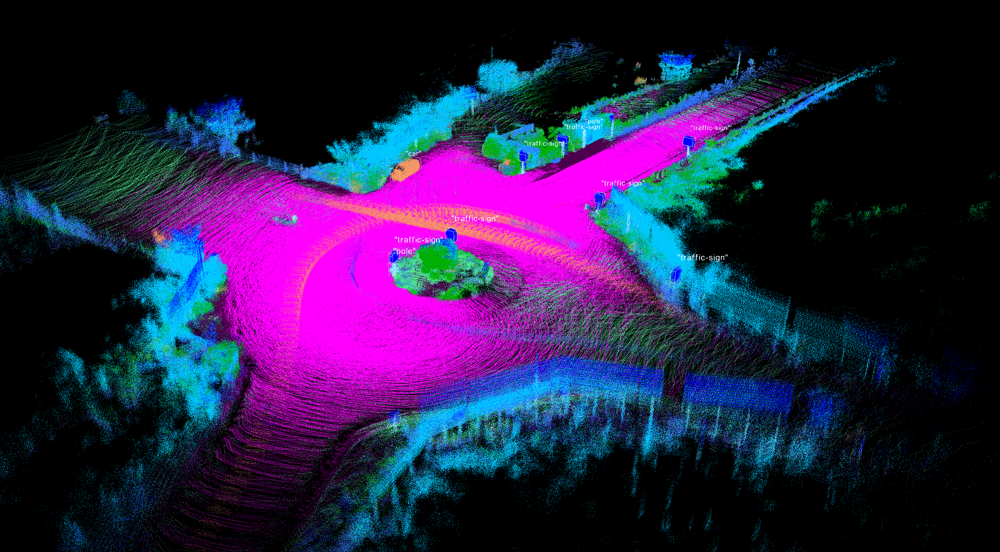

# ScanProcessor

<p align="center"></p>

![License][license-image]
![Status][ci-macos-12]
![Status][ci-macos-13]

[license-image]: https://img.shields.io/badge/license-MIT-green.svg?style=flat
[ci-macos-12]: https://img.shields.io/badge/macOS%20Monterey%2012-success-brightgreen
[ci-macos-13]: https://img.shields.io/badge/macOS%20Ventura%2013-success-brightgreen

## Description
### General view
The ScanProcessor project takes the results of [SegSN](https://github.com/pabloaguilarp/SegSN) as input and 
generates an accumulated, fully labeled, point cloud. Input scans must 
be geo-referenced for this project to work.

### Process explanation
#### 1. Batches
In the first place, the input scans are divided into batches of size
`batch_size` and overlap `overlap_size`. For example, if `batch_size` 
is 100 `overlap_size` is 20, the first batch will contain scans from 0 to 100,
second batch will contain scans from 80 to 180, and so on.

#### 2. Voxels
For each batch, all of its scans are loaded to memory, and an accumulated 
point cloud is generated by merging all of them. After, a voxelization
stage is performed to downsample the point cloud. When loading the scans,
a maximum range threshold can be configured. This is advantageous in two 
aspects: 1) reduces the overall memory consumption and 2) discards the
farthest points of all scans, which usually are the most noisy, also avoiding
voxel label assignment uncertainty.

A voxel is, essentially, a cuboid in space, and the points that lie inside it
are approximated to their centroid. Since all the points in the accumulated
point cloud are labeled, it may happen that the voxel points have different labels,
so ¿how is the final voxel label determined? Several criteria have been explored
to solve this problem:
* **Assign first:** this is the simplest strategy. The first point to be added to the voxel is
used to assign the label for the voxel.
* **Assign most frequent:** this is a more complex yet more accurate strategy. All labels present
in the voxel are mapped to their corresponding frequency (i.e. number of points with the label), and 
the most numerous label is assigned to the voxel.
* **Range weighting:** it has been observed that the farthest points in a scan tend to be the less 
accurate. So, if a voxel contains different labels, *range weighting* compensates this accuracy loss
and gives more attention to the labels of the closest points. A balance between labels frequency and 
point ranges is cleverly performed. This is the most accurate mechanism so far, although it requires
the `.range` files to be created.

The implementation of the voxelizer is a custom class based on the 
[PCL VoxelGrid](https://pointclouds.org/documentation/classpcl_1_1_voxel_grid.html) module, reimplemented 
to support these strategies.

#### 3. Noise filter
For each label, a noise filter is applied, either a [SOR](https://pointclouds.org/documentation/classpcl_1_1_statistical_outlier_removal.html)
(statistical outlier removal) or a [ROR](https://pointclouds.org/documentation/classpcl_1_1_radius_outlier_removal.html)
(radius outlier removal).

#### 4. Clustering
After the noise filtering stage, a label-wise clustering process is performed on those labels that are 
suitable for it. For example: cars, poles, traffic signs and other vehicles are suitable to be separated
into clusters, but uncountable entities such as road, vegetation or terrain are not. The clustering process
is performed with a [euclidean](https://pcl.readthedocs.io/en/latest/cluster_extraction.html) criteria,
given a maximum distance and minimum and maximum number of points per cluster (for each label).

#### 5. Bounding Box detection
With the objects properly separated into clusters, their bounding box is calculated, either rigid 
(along world XYZ axis) or oriented (cluster pose estimation). The results are those of the image above.

### Parameters
All the general processing parameters and per-label parameters can be loaded from a JSON file, including visualization
colors, visualization labels, label names, etc. The application labels are passed via command line arguments to
the program. These parameters are:
```
Program options:
  -h [ --help ]                         Print usage message
  -i [ --scans-dir ] arg                Folder where scans are stored
  -l [ --labels-dir ] arg               Folder where labels are stored
  -r [ --ranges-dir ] arg               Folder where ranges are stored
  --config-json arg (=./../config_file.json)
                                        Configuration JSON filename
  --output-dir arg                      Output directory
  --voxel-leaf-size arg (=0.100000001)  Voxel leaf size (3 axis)
  -v [ --vis-mode ] arg (=semantics)    Visualization mode
  --max-range arg (=3.40282347e+38)     Max range to load scans
  --multithread arg (=0)                Number of batches to process 
                                        concurrently:
                                          [0]: use maximum
                                          [1]: single threaded
                                          [other]: use provided number of 
                                        threads (limit to maximum threads 
                                        available)
  --batch-size arg (=100)               Number of scans in batch
  --overlap-size arg (=10)              Number of overlapping scans between two
                                        consecutive batches
```

The JSON file contains a `"labels"` key where the configuration for each label is specified. The 
parameters are the following:
```
"10": {
      "name": "car",
      "visualize": false,
      "color": [
        245,
        150,
        100
      ],
      "noise_filter": {
        "use": true,
        "type": "ror",
        "sor": {
          "mean_k": 50,
          "stddev_mul_thres": 0.5
        },
        "ror": {
          "radius": 0.2,
          "min_neighbors": 50
        }
      },
      "euclidean_clustering": {
        "use": true,
        "cluster_tolerance": 0.25,
        "min_cluster_size": 50,
        "max_cluster_size": 0,
        "min_cluster_volume": 10,
        "max_cluster_volume": 50,
        "bbox_method": "rigid"
      }
    }
```
This example corresponds to label `"car"`, which has `id` 10 and the specified parameters for
the process chain. A fine-tuned configuration file is provided in this project ([config_file.json](config_file.json)),
which is loaded by default. Custom files can be used by passing the program argument `--config-json` with the 
route to the custom file.

## Execution
### Generating the executable
To generate the executable, run `CMake` on the main folder (folder containing `CMakeLists.txt` file). The 
following dependencies are needed:
- [PCL](https://pointclouds.org) (tested with 1.12)
- [Boost](https://www.boost.org) (included with PCL if installed using prebuilt binaries)
- [JSON](https://github.com/nlohmann/json) (tested with 3.2.0)

### Running the program
To execute this program, the results of [SegSN](https://github.com/pabloaguilarp/SegSN) must be
generated first. After that, run the following command:
```
ScanProcessor 
    --scans-dir "path/to/scans/scans_world_frame"
    --labels-dir "path/to/segsn_results/predictions"
    --ranges-dir "path/to/segsn_results/ranges"
    --output-dir "path/to/results/folder"
```
After running this command, the accumulated, labeled point cloud is generated. You can customize the 
parameters by setting the corresponding values on the program arguments, and by modifying the
configuration JSON file.